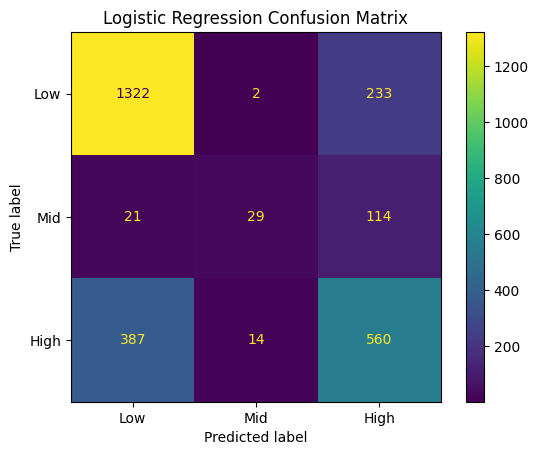
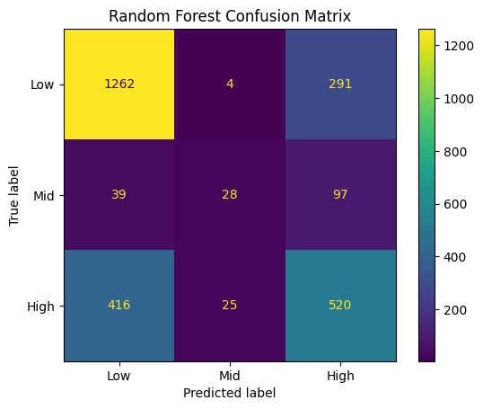
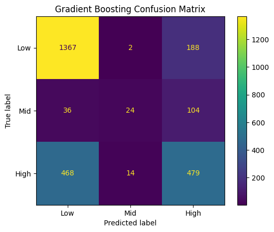
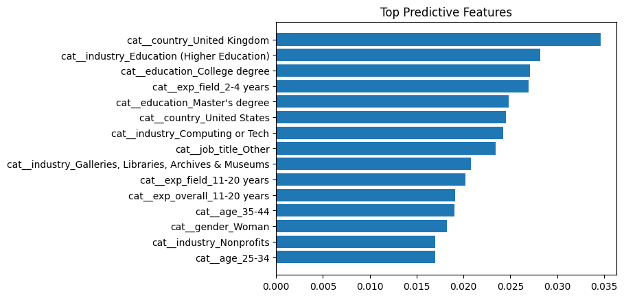

# Salary Prediction Classification (Low / Mid / High)

## Overview
This project predicts salary bands (Low, Mid, High) using demographic and job-related features from the Ask A Manager Salary Survey dataset.  
The problem is formulated as a multiclass classification task and multiple machine learning models are compared.

---

## Objectives
- Transform raw survey responses into structured features  
- Engineer categorical variables and reduce high-cardinality job titles  
- Train and compare classification models  
- Evaluate performance using accuracy, confusion matrices, and feature importance  

---

## Dataset
Ask A Manager Salary Survey 2024  

**Features**
- age  
- industry  
- job_title  
- exp_overall  
- exp_field  
- education  
- gender  
- country  

**Target**
- salary_class  
  - Low (<40k)  
  - Mid (40–80k)  
  - High (>80k)  

---

## Methodology
1. Data cleaning and preprocessing  
2. Salary band creation from numeric salary  
3. Feature engineering (job title cardinality reduction)  
4. One-hot encoding of categorical variables  
5. Feature scaling of numeric variables  
6. Model training and comparison  

**Models**
- Logistic Regression  
- Random Forest  
- Gradient Boosting  

---

# Model Accuracy Comparison

Tree-based models outperform Logistic Regression, indicating nonlinear relationships between experience, industry, and salary.

---

# Confusion Matrices

## Logistic Regression

## Random Forest

## Gradient Boosting

Most misclassification occurs between Mid and High salary classes due to overlapping salary ranges near class boundaries.

---

# Feature Importance (Random Forest)

Most influential predictors:
- experience  
- industry  
- job title  
- country  
- education  

---

# Results Summary
- Random Forest and Gradient Boosting achieved higher accuracy than Logistic Regression  
- Salary prediction depends on nonlinear interactions between experience, industry, and role  
- Feature importance aligns with labour-market salary theory  

---

# Repository Structure
